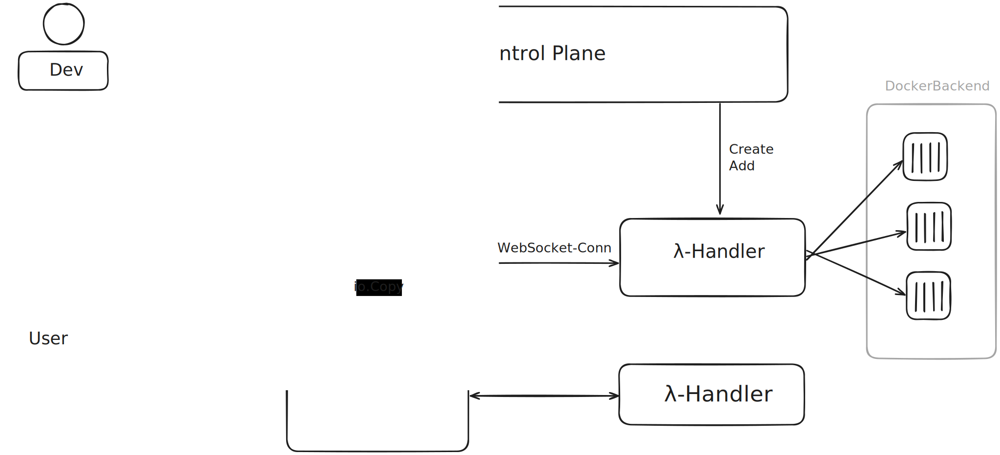

# AubeFaaS

The Aube (French pronunciation: [ob]) is a river in France, a right tributary of the Seine, and a Function-as-a-Service Plattform optimized for Streaming Operations.

---
### Prerequisites:
- Go 1.23 >=
- Docker
- docker-mac-net-connect
- make

---
### Important Steps front up

```shell
# To Bridge the messages -> Only required on macOS (bridges from OS -> Linux VM in which Docker runs)
sudo docker-mac-net-connect
```

**Start the Control-Plane and the Reverse Proxy:**
```shell
# Please execute this command in the root-directory of the project
make start 
```

**Upload a Function**

```shell
sh ./scripts/upload.sh <folder-name> <name>
```
Example:
```shell
sh ./scripts/upload.sh ./test/fn test_function
```


---
# Architecture



---

